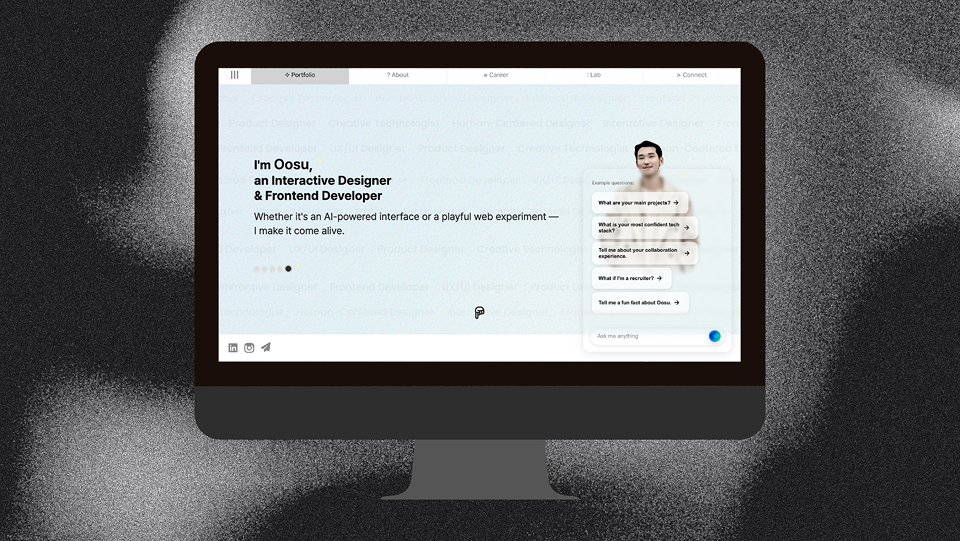
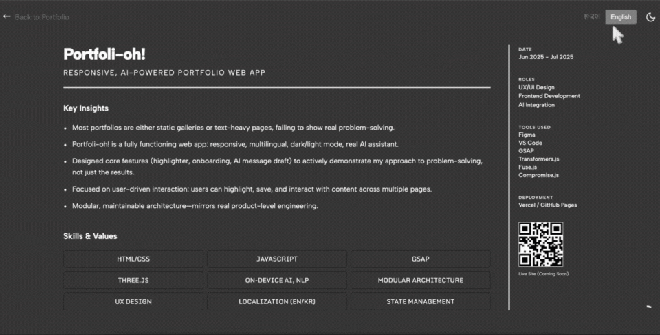
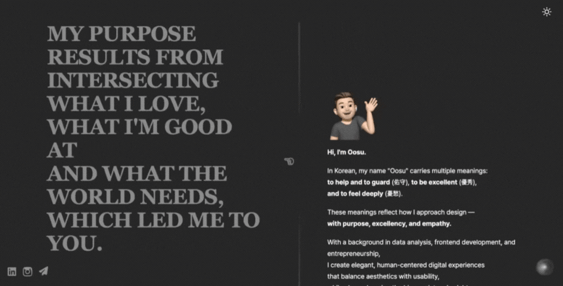
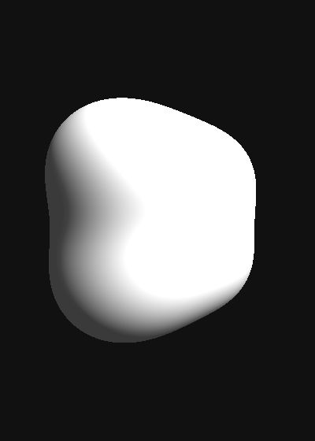
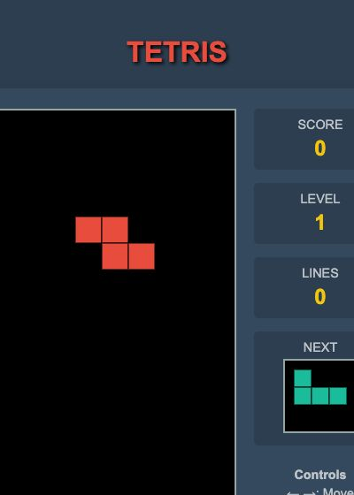
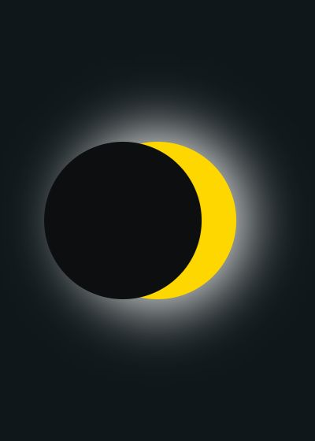
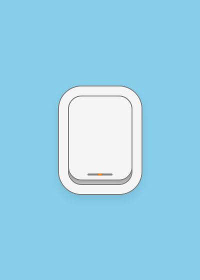

# portfoli-oh

Legacy portfolio site and frontend experiment archive for Gabriel Jang. This repository is kept public as a visual record of the first portfolio system: project pages, custom interactions, language switching, and the lab pieces built while learning frontend fundamentals.

[Live site](https://portfoli-oh.oosu.dev) · [Frontend Lab](https://lab.oosu.dev)



## 한국어 요약

`portfoli-oh`는 2025년에 만든 첫 개인 포트폴리오와 프론트엔드 실험들을 보존한 **legacy portfolio archive**입니다. 현재 메인 포트폴리오는 [oosu.dev](https://oosu.dev)로 이동했지만, 이 저장소는 HTML/CSS/Vanilla JavaScript만으로 직접 만든 인터랙션과 시각 실험의 성장 과정을 보여주기 위해 공개 상태로 유지합니다.

- 프로젝트 상세·경력·연락처까지 직접 구성한 정적 포트폴리오 정보 구조
- 커스텀 커서, 스크롤 전환, 다국어 전환, 초기 AI chat UI 실험
- JavaScript/Canvas/3D와 pure CSS 기반 Frontend Lab
- 실제 동작 GIF와 Lab screenshot을 README에서 바로 확인 가능
- 현재 AI/RAG 기반 `oosu.dev`와 비교할 수 있는 이전 세대 구현 기록

완성된 최신 기술 스택을 보여주는 저장소라기보다, **초기 프론트엔드 기초부터 현재 full-stack/AI 제품으로 발전한 과정**을 보여주는 포트폴리오 아카이브로 보는 것이 정확합니다.

## What This Shows

- Static portfolio information architecture with project detail pages, career pages, contact surfaces, and custom navigation.
- Interaction-heavy UI studies: custom cursor, scroll transitions, language switching, and a first AI-chat interface prototype.
- Frontend Lab experiments covering JavaScript canvas/DOM work and CSS-only motion studies.
- A useful before/after reference for the newer `oosu.dev` AI portfolio and RAG-backed project explorer.

## Visual Highlights

| Language switch | AI chat prototype |
| --- | --- |
|  |  |

| JavaScript 3D blob | JavaScript Tetris | CSS solar eclipse | CSS airplane window |
| --- | --- | --- | --- |
|  |  |  |  |

## Architecture

```text
portfoli-oh/
├── index.html                  # static entry point
├── common/                     # shared navigation, footer, styles, scripts
├── project/                    # project listing page
├── projectdetail/              # per-project detail pages and media assets
├── lab/
│   ├── lab.html                # original lab gallery entry
│   ├── javascript/             # JavaScript visual experiments
│   ├── pure-css/               # CSS-only visual experiments
│   └── screenshot-automator/   # captured lab thumbnails
└── api/chat.js                 # serverless-only prototype route using env vars
```

The site is intentionally simple: HTML, CSS, and vanilla JavaScript. That makes it easy to preserve as a portfolio artifact, while the newer `oosu.dev` site can own the current RAG/chat architecture.

## Security And Public Sharing Notes

- The public lab chat demo is now local-only. It does not ship provider API keys or call an external AI provider directly from the browser.
- Server-side AI calls must be routed through a backend/serverless endpoint that reads keys from environment variables.
- Any provider key that was previously committed or published from a browser bundle should be treated as exposed and revoked/rotated.
- Build artifacts, local editor settings, and private credentials should remain outside git.

## Running Locally

This is a static site. Open `index.html` directly in a browser, or serve the folder with any static file server:

```bash
python3 -m http.server 8080
```

Then open `http://localhost:8080`.
